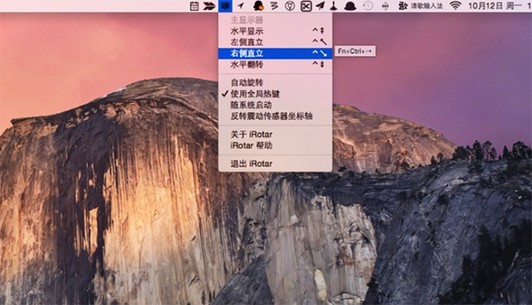

# iRotar

[中文](README.md) | [English](README.en.md) | [Deutsch](README.de.md)

Automatically rotate the screen with the built-in sudden motion sensor of the MacBook Pro.

## Introduction

**iRotar for Mac** is a utility app for macOS that makes it easy to rotate your Mac notebook screen. You can rotate the display from the system menu, use global hotkeys, or let the notebook rotate automatically. It can also adjust the built-in touchpad direction together with the screen. This is made possible by the sudden motion sensor built into Apple notebooks.

## Limitations

Currently, only 64-bit macOS systems are supported. In manual rotation mode, the app tries to rotate the display where the mouse cursor is currently located, but this behavior has not been fully tested.

## Hints

The sensor axis direction may differ between notebook models. In automatic rotation mode, iRotar may rotate the screen in the exact opposite direction on some machines. If that happens, enable "Swap Sensor Axes" from the menu.



## Reference: How to Change Keybinding

http://apple.stackexchange.com/questions/16135/remap-home-and-end-to-beginning-and-end-of-line
http://superuser.com/questions/257199/arbitrary-key-remapping-on-a-mac
https://discussions.apple.com/thread/1924733?start=0&tstart=0

## Reference: Sudden Motion Sensor Access Library

```
Copyright (c) 2010 Suitable Systems
All rights reserved.

Developed by: Daniel Griscom
              Suitable Systems
              http://www.suitable.com

For more information about SMSLib, see
     <http://www.suitable.com/tools/smslib.html>
or contact
     Daniel Griscom
     Suitable Systems
     1 Centre Street, Suite 204
     Wakefield, MA 01880
     (781) 665-0053
```
