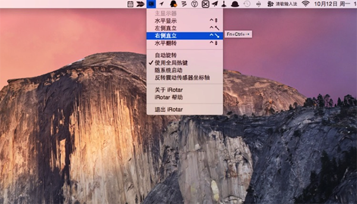

# iRotar


## Introduction

**iRotar for Mac**是一款可以在苹果电脑MAC OS平台上使用的系统工具，它可以使你方便地旋转你的苹果笔记本屏幕。 你可以通过系统菜单，也可以通过全局热键，甚至可以让苹果笔记本自己来旋转屏幕，它还能同时旋转笔记本内置的触摸板的坐标指向。这要归功于苹果系列笔记本内置的防震传感器！需要此款工具的朋友们可以前来下载使用。


## Limitations

当前只支持64位的OSX系统。当使用手动旋转方式时，程序尽量尝试旋转鼠标当前所在的屏幕，但是这个功能尚未经过完全测试。


## Hints

由于不同型号笔记本之间防震传感器的坐标轴指向并不一致，在自动旋转模式下，iRotar可能会把屏幕旋转到完全相反的方向，如果您碰到了这种情况，请在菜单中选中“反转震动传感器坐标轴”。




## Reference: how to change keybinding

http://apple.stackexchange.com/questions/16135/remap-home-and-end-to-beginning-and-end-of-line
http://superuser.com/questions/257199/arbitrary-key-remapping-on-a-mac
https://discussions.apple.com/thread/1924733?start=0&tstart=0


## Reference: Sudden Motion Sensor Access Library

```
Copyright (c) 2010 Suitable Systems
All rights reserved.

Developed by: Daniel Griscom
              Suitable Systems
              http://www.suitable.com

For more information about SMSLib, see
     <http://www.suitable.com/tools/smslib.html>
or contact
     Daniel Griscom
     Suitable Systems
     1 Centre Street, Suite 204
     Wakefield, MA 01880
     (781) 665-0053
```
